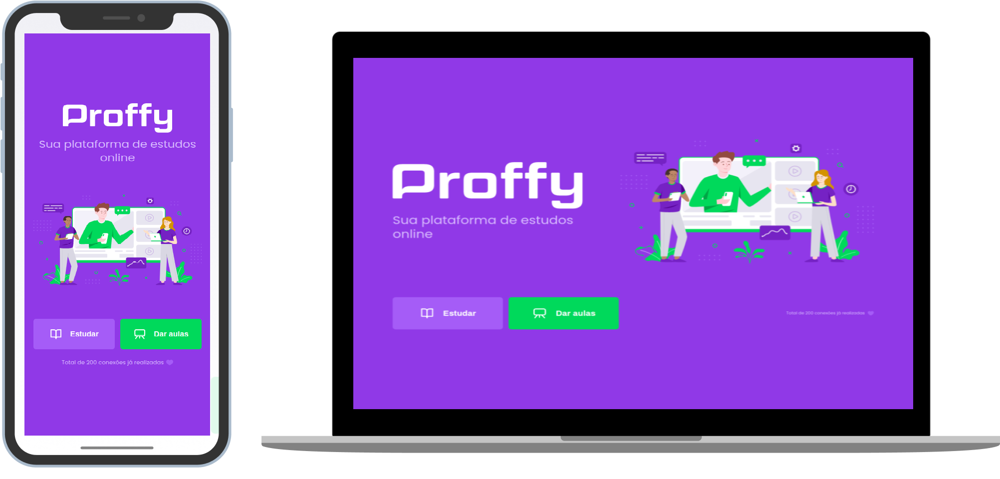

<h1 align="center">
    
</h1>

<h4 align="center"> 
	Proffy -  NextLevelWeek 2.0 🚀
</h4>
<p align="center">
  
</p>

<p align="center">	
  
	
  <a href="https://www.linkedin.com/in/cassio-doria/">
    
  </a>

  <a aria-label="Completed" href="https://nextlevelweek.com/aulas/booster/1/edicao/1">
    </img>
  </a>
  
  <a href="https://github.com/cassiodoria/proffy/commits/master">
    
  </a>

  <a href="https://github.com/cassiodoria/proffy/blob/master/LICENSE">
    
  </a>
</p>

<p align="center">
  <a href="#projeto">Projeto</a>&nbsp;&nbsp;&nbsp;|&nbsp;&nbsp;&nbsp;
  <a href="#tecnologias">Tecnologias</a>&nbsp;&nbsp;&nbsp;|&nbsp;&nbsp;&nbsp;
  <a href="#como-usar">Como Usar</a>&nbsp;&nbsp;&nbsp;|&nbsp;&nbsp;&nbsp;
  <a href="#como-contribuir">Como contribuir</a>&nbsp;&nbsp;&nbsp;|&nbsp;&nbsp;&nbsp;
  <a href="#licença">Licença</a>
</p>

# 💻Projeto

O projeto **Proffy** foi desenvolvido na NextLevelWeek 2.0 🚀 oferecido pela [Rocketseat]. É um projeto completo com backend (API), Aplicação Web e Aplicação Mobile.<br />



 Na **Aplicação Web** é possível *Estudar* e/ou *Dar Aulas*. Os professores podem cadastrar aulas informando o preço por hora, os dias e horários que o professor tem disponibilidade e o contato (whatsapp). Os alunos podem ver as aulas disponíveis filtrando por máteria, dia e horário. Além disso, é possível entrar em contato direto com o professor, redirecionando o aluno para o aplicativo do Whatsapp (deep link).<br /> 
Já o servidor backend gerencia os dados cadastros e disponíbiliza o acesso aos dados via **API REST**<br />
No **Aplicativo Mobile** é possível consultar todas as aulas disponíveis assim como na aplicação web. Uma funcionalidade exclusiva do mobile é poder favoritar as aulas que deseja.

# 🛠Tecnologias

### Server (API)
* [Node.JS](https://nodejs.org/en/docs/)
* [TypeScript](https://www.typescriptlang.org/)
* [Express](https://expressjs.com/)
* [SQLite](https://www.sqlite.org/index.html)
* [Knex](http://knexjs.org/)
* [Cors](https://github.com/expressjs/cors)

### Web
* [ReactJS](https://reactjs.org/)
* [TypeScript](https://www.typescriptlang.org/)
* [Axios](https://github.com/axios/axios)

### Mobile
* [React Native](https://reactnative.dev/)
* [Expo](https://docs.expo.io/)
* [Axios](https://github.com/axios/axios)

#  🚀Como Usar

Para usar a aplicação, você precisa de [Git](https://git-scm.com) e [Yarn][yarn] instalado no seu computador. Com as ferramentas instaladas, basta seguir os passos a seguir:

### Clonar o projeto

```bash
# Clonar o projeto Proffy do repositório
$ git clone https://github.com/cassiodoria/proffy
```

### Server (API) 

```bash
# Entre na pasta server
$ cd proffy/server

# Instale as dependências
$ yarn

# Crie o arquivo de banco de dados (database.sqlite) e suas tabelas
$ yarn knex:migrate


# Executa o servidor no endereço localhost a porta 3333
$ yarn start
```


### Web

```bash
# Entre na pasta web
$ cd proffy/web

# Instale as dependências
$ yarn

# Execute a aplicação web. A aplicação será aberta no endereço localhost na porta 3000
$ yarn start
```


### Mobile
Para testar a aplicação mobile, é possível usar um emulador ou a ferramenta [Expo] no seu celular.

```bash
# Entre na pasta mobile
$ cd proffy/mobile

# Instale as dependências
$ yarn

# Execute a aplicação mobile. A ferramenta Expo irá abrir. Basta escanear o qrcode no próprio terminal ou na página do Expo que irá abrir no browser. 
$ yarn start
```

# 🤔Como contribuir

- Faça um fork desse repositório;
- Cria uma branch com a sua feature: `git checkout -b minha-feature`;
- Faça commit das suas alterações: `git commit -m 'feat: Minha nova feature'`;
- Faça push para a sua branch: `git push origin minha-feature`.

Depois que o merge da sua pull request for feito, você pode deletar a sua branch.

# 📝Licença

Esse projeto está sob a licença MIT. Veja o arquivo [LICENSE](https://github.com/cassiodoria/proffy/blob/master/LICENSE) para mais detalhes.

Feito com ♥ by [Cássio Dória](https://www.linkedin.com/in/cassio-doria/)

[yarn]: https://yarnpkg.com/
[typescript]: https://www.typescriptlang.org/
[expo]: https://expo.io/
[reactjs]: https://reactjs.org
[rn]: https://facebook.github.io/react-native/
[Rocketseat]: (https://www.rocketseat.com.br)
[Insomnia]: (https://insomnia.rest/)
[Expo]: (https://play.google.com/store/apps/details?id=host.exp.exponent&hl=en)